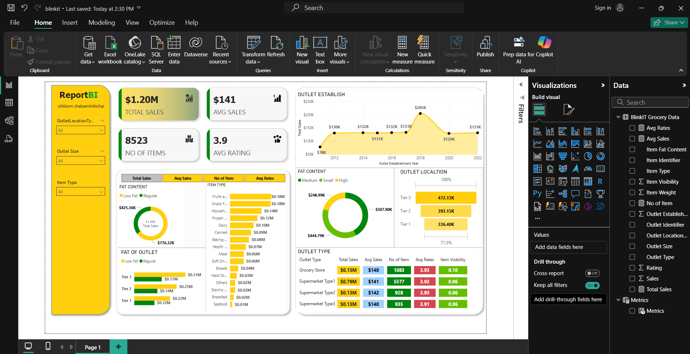

# DashBoardWithPowerBIdataOutlet

## tools in this project
- PowerBI
## prepare data
I prepare data with transform data in Item fat content
  |old data|new data|
  |:-|:-|
  |LF|Low Fat|
  |low fat| Low Fat|
  |reg| Regular|

thank you in reference this liknk https://www.youtube.com/watch?v=mmxVCFceQgU&list=WL&index=2&t=2118s
